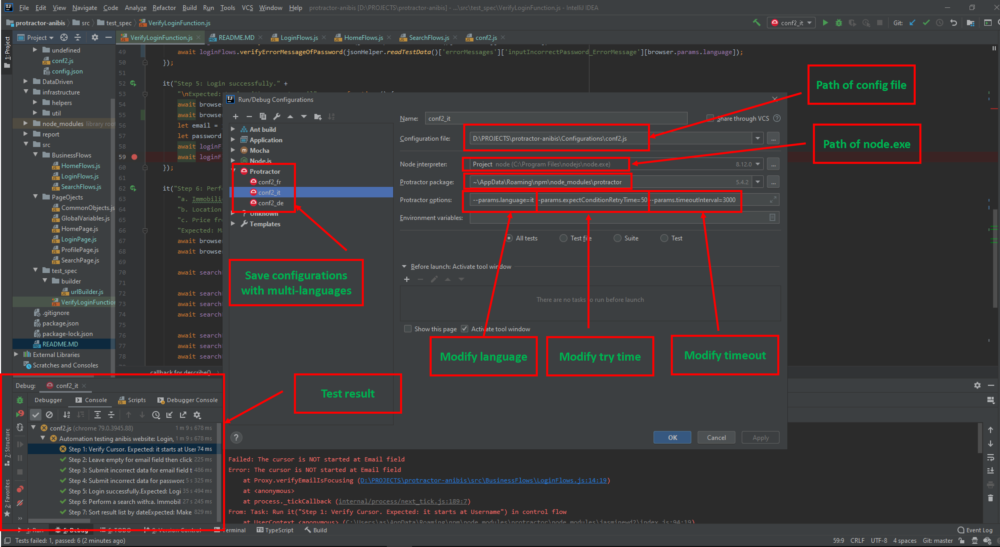

## My note:
* Handle multiple languages also does NOT include in the assessment, I just want to do with the hope I will be get some plus point from interviewers.
* [verifySortingOfResultList] method still have not handle for sort price due to limit time, therefore I use else to throw error to void automation will pass this method without any action when using with not handled sort type
* I would also script for a beautiful report if I have more time.
* If I have more time, I'll overview all web pages as well as data to consider how I should separate testData.json to specialized .json files.
But one thing I make sure will do - using better way to manage for multi languages.
* In my project, we have to send run to to customer as well as push into test case management tool, therefore I rarely used assertion for verifying. However I can use them competently in case of need. Please don't worry about that!  

## Setup:
* Install [Node](http://nodejs.org) (v8.x.x or later)
* Install java SDK and set java home
* In project directory:
    * `npm install`
    * `npm install -g protractor`
    * `webdriver-manager update` (recommended:  `webdriver-manager update --versions.chrome=2.42`)
    * `webdriver-manager start` (recommended: ` webdriver-manager start --versions.chrome=2.42`)
    * `npm i` to install the project dependencies

## Run tests:
* Run tests by command line
    1. start webdriver: `webdriver-manager start --versions.chrome=2.42`
    2. direct to directory of config file: `cd Configurations`
    3. Run test with basic command:
        * `protractor conf2.js` : default language: fr, default params.expectConditionRetryTime=1000, default params.timeoutInterval=500
    
    Test multi-language with one of commands:
        * German: `protractor conf2.js --params.language=de`
        * Italian: `protractor conf2.js --params.language=it`
        * French: `protractor conf2.js --params.language=fr`
       
    Run test with custom retry time and timeoutInterval
        * German: `protractor conf2.js --params.language=de --params.expectConditionRetryTime=1000 --params.timeoutInterval=5000`
        * Italian: `protractor conf2.js --params.language=it --params.expectConditionRetryTime=1000 --params.timeoutInterval=5000`
        * French: `protractor conf2.js --params.language=fr --params.expectConditionRetryTime=1000 --params.timeoutInterval=5000`
        
* Run tests via IntelliJ IDEA - Ultimate
    1. start webdriver: `webdriver-manager start --versions.chrome=2.42`
    2. Setup config

    3. Click run button in top menu of IntelliJ or using short key `Shift + F10`
    
## Log files: 
View log files in `root/reports`.
(This folder will store reports in the future)