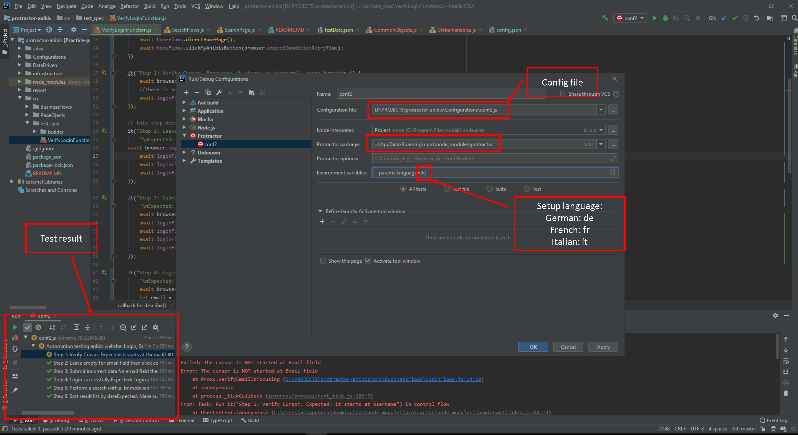

## Setup:
* Install [Node](http://nodejs.org) (v8.x.x or later)
* In project directory:
    * `npm install`
    * `npm install -g protractor`
    * `webdriver-manager update` (recommended:  webdriver-manager update --versions.chrome=2.42)
    * `webdriver-manager start` (recommended:  webdriver-manager start --versions.chrome=2.42)
    * `npm i` to install the project dependencies

## Run tests:
* run tests by command line
    1. `cd Configurations`
    2. test multi-language
        * German: `protractor conf2.js --params.language=de`
        * Italian: `protractor conf2.js --params.language=it`
        * French: `protractor conf2.js --params.language=fr`
        
*run tests via IntelliJ IDEA - Ultimate
